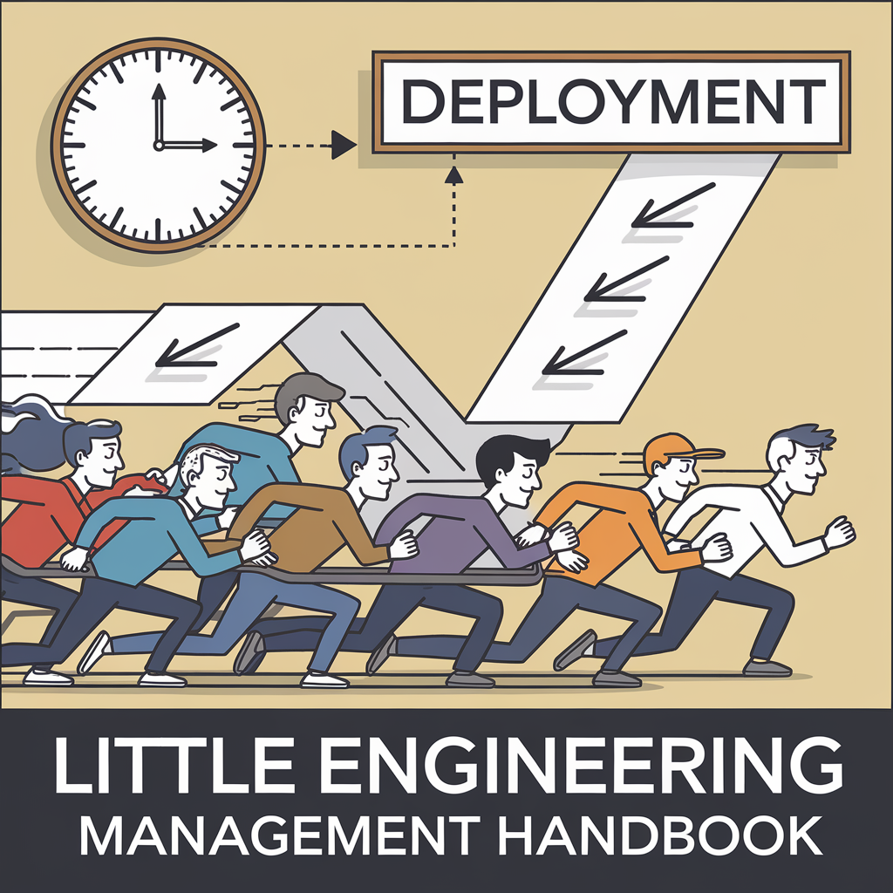

# The First Dirty Dozen

How to scale engineering from 0 to N and deliver the first product

# Introduction

I wrote this guide over the past years as an accumulation of experiences and notes mostly learned while working at ground zero startups that were just starting to grow (0-50 engineers). The guide was originally tailored to new first-line managers - people who had never managed a team or newly hired managers joining the team. My biggest goal was to establish a coherent and unified management style across teams at a company, which is crucial for reducing chaos in the early stages of a startup and facilitating team mobility.

This guide can be thought of as a checklist of things a manager will be responsible for, and a reference for the tools available to the new manager. Also the guide is not meant to be a set of rules to blindly follow; true leadership must be natural and heartfelt, meaning adapt this handbook to your style and what works best for the team and the company at that particular time and moment.

Remember that this handbook is a living document. As your organization grows and evolves, you should adapt these principles and practices accordingly. Embrace change and continuously strive for improvement. For example feel free to fork this handbook and adapt it to your own org specific needs.

{: .note } 
> "Managing and leading is not about giving tasks to people, it is achieving a goal with the **HELP** of people.
> Remember that ultimately you lead people and manage things."

# To The Reader

If you are an experience manager, hope you still will find some valid ideas in the next chapters of the book. Again I am not trying to say this is the only way to manage and lead teams from the ground up, but this is the approach I used and seemed to work.
If you are a new manager and trying to learn how to effectively lead a team, welcome to this journey. I hope this handbook will help you in your new adventure.

Not to scare you the reader, but managing people is not as easy as it sounds. If you make a mistake you impact people and usually not alwasy easy to fix.
A/B testing an idea is often impossible, hence learning from past mistakes is key to yours and your teams success.

## Imposter Syndrome

As a new manager joining a team, or being promoted into this role you might feel like an imposter. Don't worry you are not alone.
I personally always found it healthy feeling a bit like an imposter, since help you to listen to feedback and constantly trying to improve yourself.
And it seems now there is even some research showing that some imposter syndrome might be helpful ([Imposter Syndrome](references.html#imposter-syndrome))

# The People, The Product, The Resources

The books mostly focuses on what I believe are the core competences of the manager in priority order:

* People: Without people nothing will get done, focusing on having a productive team, that jells and focuses on getting the right things done is not only a good thing, but is extremely rewarding to be part of such a team since magic will happen. A great team makes a great product.
* Product: Second without a product there is not company. Building a great product hence is vital, so focusing on shipping a great product in time is quite obviously a vital task.
* Resources: Lastly managing the resources needed by your team to develop and ship the product is a crucial task.

The book is organized around these three themes, and will add some additional color to other secondary topics.

