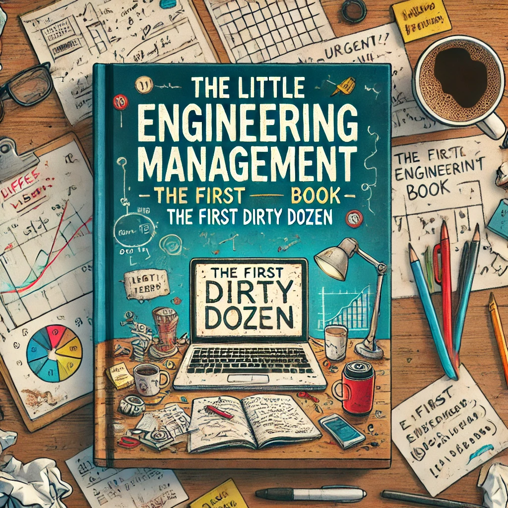

# The First Dirty Dozen

How to scale engineering from 0 to N and deliver the first product

# Introduction

I wrote this guide over the years as a collection of experiences and lessons learned while working at early-stage startups (0-50 engineers). The guide was originally tailored to new first-line managers - people who had never managed a team or newly hired managers joining the team. My primary goal was to create a consistent management style across teams, crucial for reducing chaos in a startup’s early stages and enhancing team mobility.

This guide can be thought of as a checklist of things a manager will be responsible for, and a reference for the tools available to the new manager. Also the guide is not meant to be a set of rules to blindly follow; true leadership must be natural and heartfelt, meaning adapt this handbook to your style and what works best for the team and the company at that particular time and moment.

Remember that this handbook is a living document. As your organization grows and evolves, you should adapt these principles and practices accordingly. Embrace change and continuously strive for improvement. For example feel free to fork this handbook and adapt it to your own org specific needs.

{: .note } 
> "Managing and leading is not about giving tasks to people, it is achieving a goal with the **HELP** of people.
> Remember that ultimately you lead people and manage things."

# To The Reader

If you are an experience manager, hope you still will find some valid ideas in the next chapters of the book. Again I am not trying to say this is the only way to manage and lead teams from the ground up, but this is the approach I used and seemed to work.
If you are a new manager and trying to learn how to effectively lead a team, welcome to this journey. I hope this handbook will help you in your new adventure.

Not to scare you, but managing people is not as easy as it sounds. Mistakes can have a lasting impact on people and are not always easy to fix.
A/B testing an idea is often impossible, hence learning from past mistakes is key to yours and your teams success.

## Imposter Syndrome

As a new manager joining a team, or being promoted into this role you might feel like an imposter. Don't worry you are not alone.
I have personally always found it healthy to feel like an imposter, as it helps you listen to feedback and continuously improve yourself.
And it seems now there is even some research showing that some imposter syndrome might be helpful ([Imposter Syndrome](references.html#imposter-syndrome))

# The People, The Product, The Resources

This book primarily focuses on what I believe are the core competencies of a manager, listed in order of priority:

* People: A productive team is the foundation of success. Fostering collaboration and alignment ensures that the right things get done. Being part of a great team is not just beneficial—it’s where the magic happens. Although a great team is not a guaranteer for a great products, a bad team rearly will build a great product.
* Product: Second without a product there is not company. Building a great product hence is vital, so focusing on shipping a great product in time is quite obviously a vital task.
* Resources: Lastly managing the resources needed by your team to develop and ship the product is a crucial task.

The book is organized around these three themes, and will add some additional color to other secondary topics.
